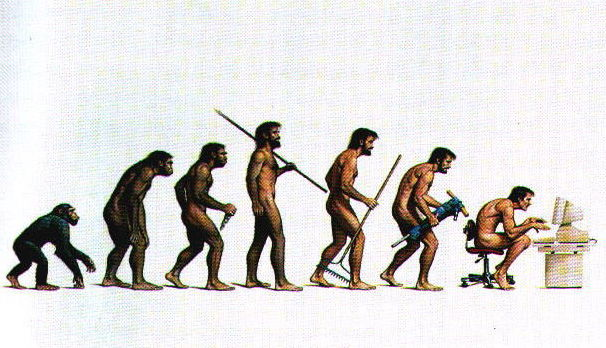

# 遗传算法笔记

[TOC]

遗传算法（GA, Genetic Algorithm）是进化算法的一种，是借鉴了进化生物学中的一些现象来进行最优解搜索的方法[[1](#ref01)]。

# 一、进化论

达尔文在1859年出版的《物种起源》一书中详细的阐述了他的进化学说。主要论证了两个问题：

1. 物种是可变得，生物是进化的。
2. 自然选择是生物进化的动力。

这都不是本文的重点，在遗传算法中，我们需要理解的生物学只是主要有以下几点：

* 基因：

物竞天择，适者生存。

#二、遗传算法

# 附录

[1] https://zh.wikipedia.org/wiki/%E9%81%97%E4%BC%A0%E7%AE%97%E6%B3%95